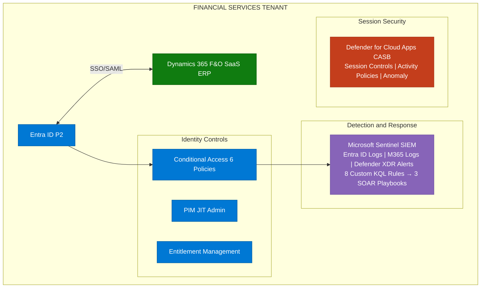
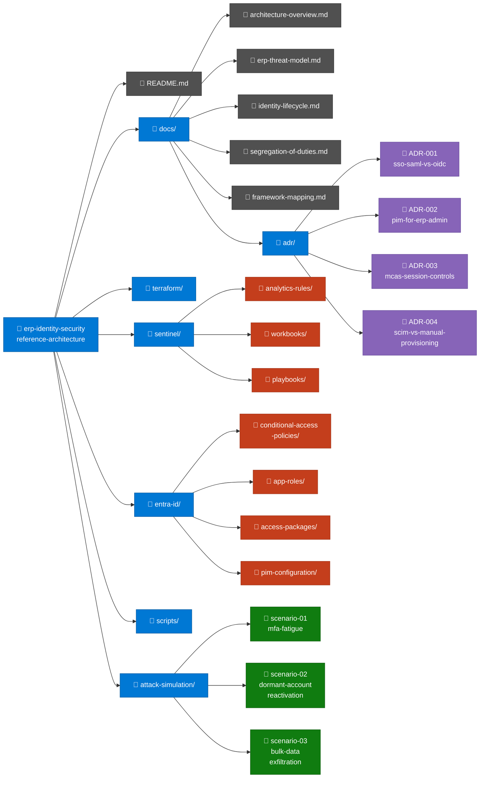

# Zero Trust Identity Security for SaaS ERP
### Microsoft Dynamics 365 — Reference Architecture using Entra ID, Sentinel, and Defender for Cloud Apps

> A reference implementation of a Zero Trust security architecture securing a Dynamics 365 Financial Services deployment. Built using Microsoft Sentinel, Entra ID P2, and Defender for Cloud Apps — deployed as Infrastructure-as-Code and mapped to the ACSC Essential Eight and Victorian Protective Data Security Standards (VPDSF).

---

## Overview

This project models the identity and access security architecture for a mid-sized financial services organisation migrating their ERP to Microsoft Dynamics 365. It demonstrates how to secure the identity layer, monitor for threats specific to financial ERP workloads, and enforce access governance across the SaaS environment using Microsoft's native security stack.

The architecture is designed around three core principles:
- **No standing privileged access** — all Dynamics 365 admin roles are time-limited via PIM
- **Identity is the perimeter** — Conditional Access enforces Zero Trust for every ERP session
- **Assume breach** — Sentinel detects and responds to ERP-specific threat scenarios automatically

---

## Architecture Overview

---

## Simulated Organisation

| Attribute | Detail |
|---|---|
| **Organisation** | Contoso Financial Services (fictitious) |
| **Industry** | Financial Services |
| **ERP** | Microsoft Dynamics 365 Finance and Operations |
| **Users** | 25 across 4 departments |
| **Departments** | Finance, Procurement, IT, Risk & Compliance |
| **Deployment** | SaaS (Microsoft-hosted) |

### ERP Role Structure

| Role | Department | Sensitivity | Access Method |
|---|---|---|---|
| Finance User | Finance | Medium | Standard + MFA |
| Finance Manager | Finance | High | Compliant device + MFA |
| Procurement Officer | Procurement | Medium | Standard + MFA |
| Procurement Approver | Procurement | High | Compliant device + MFA |
| ERP System Admin | IT | Critical | PIM JIT + MFA + PAW |
| Risk Auditor | Risk & Compliance | High | Read-only + MFA |
| Global Admin | IT | Critical | PIM JIT + MFA + PAW |

---

## Security Controls Implemented

| Control | Implementation | Framework Mapping |
|---|---|---|
| MFA for all users | Entra ID CA Policy CA001 | Essential Eight ML2 |
| Block legacy authentication | CA Policy CA002 | Essential Eight ML1 |
| Compliant device for ERP | CA Policy CA003 | NIST 800-207 |
| Risk-based step-up auth | CA Policy CA004 | VPDSF ICT Security |
| ERP admin session protection | CA Policy CA005 | Essential Eight ML2 |
| Unmanaged device session control | CA Policy CA006 + MCAS | NIST 800-207 |
| JIT privileged access | PIM with approval workflow | Essential Eight ML3 |
| Automated user provisioning | SCIM + Entitlement Management | VPDSF Personnel Security |
| ERP threat detection | 8 custom Sentinel KQL rules | MITRE ATT&CK |
| Automated incident response | 3 Logic App SOAR playbooks | NIST CSF Respond |
| Bulk export detection | Defender for Cloud Apps policy | VPDSF Information Security |
| Segregation of duties | Entra ID app role constraints | ISO 27001 A.9 |

---

## Threat Scenarios

Full walkthroughs in [`attack-simulation/`](attack-simulation/)

### Scenario 1 — Insider Threat: Bulk Data Exfiltration
A Finance user with legitimate Dynamics 365 access begins exporting large volumes of supplier payment data ahead of their resignation. Defender for Cloud Apps detects the anomalous download volume. Sentinel fires the `erp-bulk-data-export` analytics rule. The SOAR playbook suspends the session and notifies the security team within minutes.

### Scenario 2 — Account Takeover via Credential Stuffing
An attacker uses a leaked credential list against the Dynamics 365 SSO login. Multiple failed attempts are followed by a successful login from an unusual location. The `erp-credential-stuffing` KQL rule fires in Sentinel. Conditional Access sign-in risk policy triggers step-up MFA automatically.

### Scenario 3 — Dormant Privileged Account Reactivation
A former ERP System Admin account is reactivated via a misconfigured HR sync. The `erp-dormant-account-activation` rule fires immediately. This scenario is used to demonstrate the joiner/mover/leaver control gap and the preventive role of automated offboarding.

---

## Repository Structure

---

## Deployment Prerequisites

- Azure subscription (free tier sufficient for lab)
- Microsoft 365 tenant with Entra ID P2
- Terraform >= 1.5
- Azure CLI
- PowerShell 7 with Microsoft.Graph module

See [`terraform/README.md`](terraform/README.md) for full deployment instructions.

---

## Framework Mappings

Full control mapping in [`docs/adr/framework-mapping.md`](docs/framework-mapping.md)

| Framework | Coverage |
|---|---|
| ACSC Essential Eight | MFA (ML2), Restrict Admin (ML2), Application Control |
| VPDSF / VPDSS | ICT Security, Information Security, Personnel Security |
| NIST 800-207 | Zero Trust Architecture principles |
| MITRE ATT&CK | T1078, T1530, T1136, T1098, T1110 |
| ISO 27001 | A.9 Access Control, A.12 Operations Security |

---

## Disclaimer

This is a lab environment using fictitious organisational data. No real personal or financial data is used. All user accounts, organisational structures, and scenarios are simulated for educational and portfolio purposes.

---

*Author: Jonar | GitHub: [jonarm](https://github.com/jonarm)*