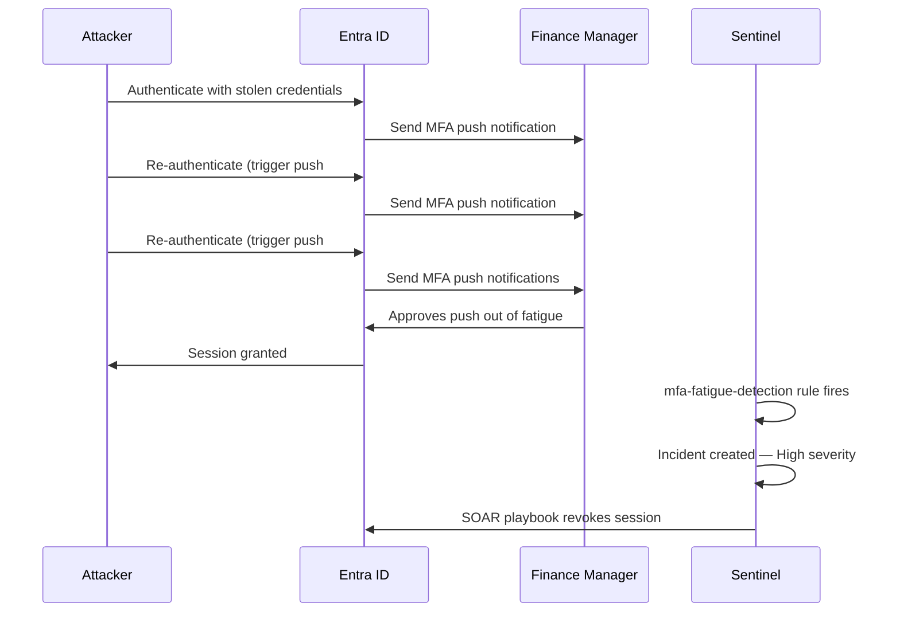

# Scenario 01 — MFA Fatigue Attack

*Author: Jonar | MITRE ATT&CK: T1621*

---

## Scenario Summary

An attacker obtains valid credentials for a Finance Manager via 
phishing. Unable to satisfy MFA normally, they bombard the user 
with repeated MFA push notifications hoping the user approves 
one out of fatigue or confusion.

---

## Attack Flow

---

## Detection

**Rule:** `mfa-fatigue-detection.json`  
**Trigger:** 10+ ResultType 50074 events for same user within 10 minutes  
**Sentinel Severity:** High  
**MITRE Tactic:** Credential Access  

---

## Lab Simulation Steps

1. Open 10 private browser tabs
2. Navigate each to `myapps.microsoft.com`
3. Sign in as `testfinanceuser@jonarmarzan.onmicrosoft.com`
4. Leave each tab on the MFA prompt screen without approving
5. Repeat within 10 minutes
6. Check Sentinel for incident

---

## Response — SOAR Playbook: ERP-Revoke-Session

| Step | Action | Actor |
|---|---|---|
| 1 | Sentinel incident created | Automated |
| 2 | ERP-Revoke-Session playbook triggered | Automated |
| 3 | All active sessions revoked via Graph API | Automated |
| 4 | Incident comment added with timestamp | Automated |
| 5 | Security analyst reviews incident | Manual |
| 6 | User contacted to verify legitimacy | Manual |
| 7 | Password reset initiated if confirmed attack | Manual |

---

## Preventive Controls

- Number matching MFA (removes push approval)
- CA001 enforces MFA for all users
- Identity Protection monitors MFA anomalies

---

## Evidence Screenshots

See `docs/screenshots/attack-simulation/`