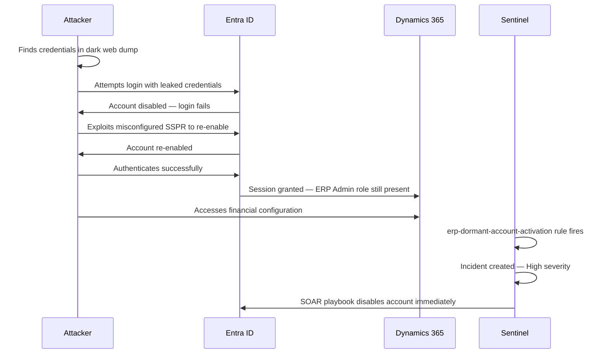

# Scenario 02 — Dormant Account Reactivation

*Author: Jonar | MITRE ATT&CK: T1078*

---

## Scenario Summary

A former ERP System Admin left six months ago. Their Entra ID 
account was disabled but their Dynamics 365 app role assignment 
was not removed. An attacker finds their credentials in a dark 
web breach dump, re-enables the account via a misconfigured 
self-service password reset policy, and accesses financial 
configuration in Dynamics 365.

---

## Attack Flow

---

## Detection

**Rule:** `erp-dormant-account-activation.json`  
**Trigger:** Account inactive 14+ days signs in successfully  
**Sentinel Severity:** High  
**MITRE Tactic:** Initial Access, Persistence  

---

## Lab Simulation Steps

1. Note `testfinanceuser` last sign-in date
2. Wait 14 days OR modify the rule threshold to 1 day for testing
3. Sign in as testfinanceuser
4. Sentinel dormant account rule fires
5. Check incident in Defender portal

**Shortcut for lab testing — modify rule threshold:**
1. Go to Sentinel → Analytics → erp-dormant-account-activation
2. Edit rule → change `14d` to `1d` in query
3. Save → trigger sign-in → change back to `14d` after testing

---

## Root Cause — The Control Gap

This scenario demonstrates the joiner/mover/leaver gap documented 
in ADR-004. The automated leaver workflow should have:

1. Removed all D365 app role assignments within 24 hours
2. Removed PIM eligible assignments
3. Blocked SSPR for disabled accounts

---

## Response — SOAR Playbook: ERP-Revoke-Session

| Step | Action | Actor |
|---|---|---|
| 1 | Sentinel incident created | Automated |
| 2 | ERP-Revoke-Session playbook triggered | Automated |
| 3 | All sessions revoked immediately | Automated |
| 4 | Security analyst notified | Automated |
| 5 | Account permanently disabled | Manual |
| 6 | All ERP role assignments audited | Manual |
| 7 | SSPR policy reviewed and hardened | Manual |

---

## Preventive Controls

- SCIM automated deprovisioning (ADR-004)
- Entitlement Management access package removal on termination
- SSPR scoped to active employees only
- Quarterly access reviews catch dormant assignments

---

## Evidence Screenshots

See `docs/screenshots/attack-simulation/`