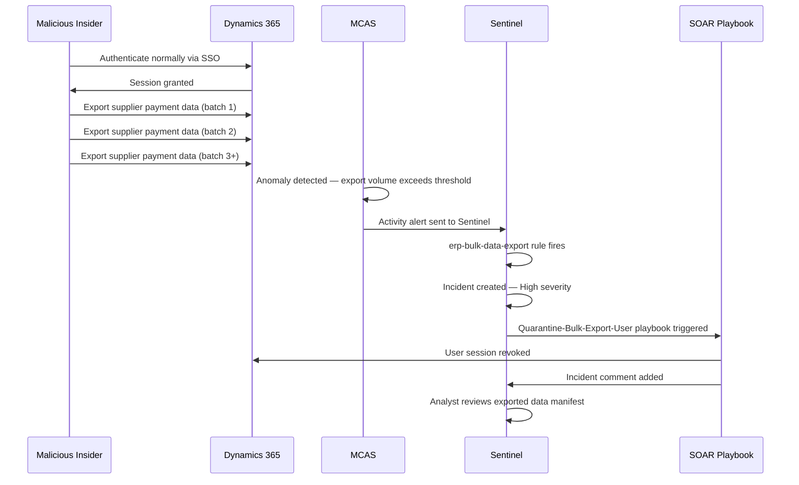

# Scenario 03 — Bulk Data Exfiltration

*Author: Jonar | MITRE ATT&CK: T1530*

---

## Scenario Summary

A Finance User with legitimate access to accounts payable in 
Dynamics 365 begins exporting large volumes of supplier payment 
records to Excel over several days before their resignation. 
The data volume significantly exceeds their normal baseline. 
Defender for Cloud Apps detects the anomaly and Sentinel 
creates a high severity incident.

---

## Attack Flow

---

## Detection

**Rule:** `erp-bulk-data-export.json`  
**Trigger:** 10+ export/download actions in 1 hour from same account  
**MCAS Policy:** Bulk download threshold exceeded  
**Sentinel Severity:** High  
**MITRE Tactic:** Collection, Exfiltration  

---

## Lab Simulation Steps

Since this scenario requires Dynamics 365 F&O which isn't 
provisioned in the lab, simulation uses SharePoint/OneDrive 
as a proxy for bulk download detection:

1. Sign in as testfinanceuser at `office.com`
2. Go to OneDrive
3. Upload 15 test files (any type)
4. Download all 15 files in quick succession
5. MCAS activity policy detects bulk download
6. Check Sentinel for incident

---

## The Insider Threat Indicators

Before detection the following behavioural indicators were present:

| Indicator | Normal Baseline | Anomalous Activity |
|---|---|---|
| Daily export volume | 10-20 records | 500+ records |
| Export time | Business hours | After hours |
| Export destination | Shared drive | Personal device |
| File format | Standard reports | Raw data exports |

---

## Response — SOAR Playbook: ERP-Quarantine-Bulk-Export-User

| Step | Action | Actor |
|---|---|---|
| 1 | MCAS alert triggers Sentinel incident | Automated |
| 2 | Quarantine-Bulk-Export-User playbook runs | Automated |
| 3 | User account disabled in Entra ID | Automated |
| 4 | All active sessions revoked | Automated |
| 5 | Incident comment with actions logged | Automated |
| 6 | Security analyst reviews export manifest | Manual |
| 7 | Legal and HR notified if confirmed | Manual |
| 8 | Data loss assessment conducted | Manual |

---

## Preventive Controls

- MCAS session controls block downloads on unmanaged devices (CA006)
- DLP policy flags bulk export of financial data
- Entitlement Management quarterly access reviews
- User and Entity Behaviour Analytics (UEBA) baseline monitoring

---

## Evidence Screenshots

See `docs/screenshots/session-05-attack-simulation/`