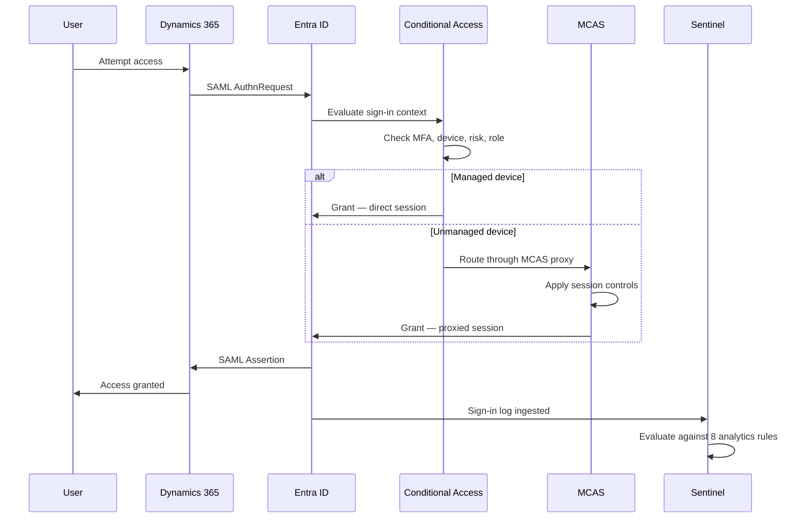

# Architecture Overview — ERP Identity Security Reference Architecture

*Author: Jonar | Repository: [jonarm](https://github.com/jonarm)*

---

## Purpose

This document provides the detailed architectural narrative behind 
the Zero Trust identity security design for Contoso Financial 
Services' Dynamics 365 deployment. It expands on the high-level 
summary in the repository README with full component reasoning, 
data flows, and design principles.

---

## Design Philosophy

This architecture is built on three Zero Trust principles, applied 
specifically to a SaaS ERP context:

### 1. Identity Is the Perimeter
There is no network-based trust boundary. Dynamics 365 is 
Microsoft-hosted SaaS — the only control point available is identity. 
Every access decision is made by Entra ID at the point of 
authentication, not by network location or VPN membership.

### 2. No Standing Privileged Access
Administrative access to both the ERP and the Entra ID tenant itself 
is time-limited and approval-gated via PIM. There is no permanently 
assigned admin role for day-to-day operations — see 
[ADR-002](adr/ADR-002-pim-for-erp-admin.md).

### 3. Verify Continuously, Not Just at Login
Conditional Access evaluates risk signals, device compliance, and 
session behaviour continuously — not only at the initial sign-in. 
Session controls (sign-in frequency, MCAS session proxying) ensure 
a compromised session is caught quickly, not just a compromised 
password.

---

## Component Architecture

### Layer 1 — Identity Provider (Entra ID)

Entra ID is the single source of truth for identity and the sole 
authentication mechanism for Dynamics 365. No on-premises Active 
Directory federation is in scope — this is a cloud-native design.

**Key components:**
- App registration for Dynamics 365 with SAML 2.0 SSO ([ADR-001](adr/ADR-001-sso-saml-vs-oidc.md))
- 9 app roles mapping to ERP functional permissions, enforced with SoD constraints ([segregation-of-duties.md](segregation-of-duties.md))
- Entra ID P2 licensing enabling Conditional Access, PIM, and Identity Protection

### Layer 2 — Access Control (Conditional Access)

Six Conditional Access policies form a layered control set:

| Policy | Purpose |
|---|---|
| CA001 | Baseline MFA enforcement for all users |
| CA002 | Eliminates legacy authentication attack surface |
| CA003 | Device compliance requirement for ERP access (report-only initially) |
| CA004 | Risk-adaptive authentication — responds to Identity Protection signals |
| CA005 | Elevated protection for any user holding admin roles |
| CA006 | Session-level data protection for unmanaged devices via MCAS |

Full technical specification in each policy's JSON definition under 
`entra-id/conditional-access-policies/`.

### Layer 3 — Privileged Access Management (PIM)

ERP System Admin and Entra ID Global Administrator roles are 
eligible-only assignments. Activation requires:
- Business justification
- MFA re-authentication (phishing-resistant where possible)
- Approval from CISO (and CTO for Global Admin — dual control)
- Time-limited window (2-4 hours maximum)

Breakglass accounts provide an emergency path outside the standard 
PIM workflow, excluded from Conditional Access, secured physically, 
and monitored with real-time alerting on any use.

Full design in [ADR-002](adr/ADR-002-pim-for-erp-admin.md).

### Layer 4 — Identity Lifecycle (SCIM Provisioning)

User access is provisioned and deprovisioned automatically based on 
HR system events rather than manual IT processes. This closes the 
most common control gap in ERP environments — delayed or missed 
deprovisioning of terminated employees.

| Event | Automation |
|---|---|
| Joiner | Account created day -5, enabled day -1, access package assigned by job title |
| Mover | Access package reassigned within 4 hours of HR role change, new granted before old removed |
| Leaver | Account disabled within 1 hour of termination event, all access removed, sessions revoked |

Full design in [ADR-004](adr/ADR-004-scim-vs-manual-provisioning.md).

### Layer 5 — Session and Data Protection (Defender for Cloud Apps)

Unmanaged devices are not blocked outright — operational reality 
requires contractor and remote access from personal devices. 
Instead, MCAS Conditional Access App Control proxies the session and 
applies:
- Download blocking
- Clipboard restriction (cut/copy)
- Watermarking
- Step-up authentication for sensitive ERP modules

Full design in [ADR-003](adr/ADR-003-mcas-session-controls.md).

### Layer 6 — Detection and Response (Microsoft Sentinel)

Eight custom KQL analytics rules monitor for ERP-specific threat 
scenarios, each mapped to a MITRE ATT&CK technique:

| Rule | MITRE Technique |
|---|---|
| MFA Fatigue Detection | T1621 |
| Impossible Travel | T1550 |
| Bulk Data Export | T1530 |
| Dormant Account Activation | T1078 |
| Admin Activation Outside Hours | T1078.004 |
| Service Principal Interactive Sign-In | T1528 |
| Credential Stuffing | T1110.004 |
| Privileged Role Assignment | T1098 |

Three SOAR playbooks automate initial response — session revocation, 
admin notification, and user quarantine — reducing mean time to 
respond from hours to minutes.

Full threat model and scenario walkthroughs in 
[erp-threat-model.md](erp-threat-model.md) and `attack-simulation/`.

---

## Data Flow — Authentication Sequence

---

## Why This Design Over Alternatives

**Why not network-based segmentation?** Dynamics 365 is SaaS — there 
is no network perimeter to segment. Identity-based control is the 
only viable model.

**Why not block all unmanaged devices?** Financial services 
organisations rely heavily on contractors and remote executive 
access. A blanket block creates pressure for risky exceptions over 
time. Session-level control is more sustainable.

**Why hybrid SAML/OIDC rather than one protocol?** Dynamics 365's 
most mature enterprise SSO path is SAML; API and service principal 
flows are better served by OIDC's support for Continuous Access 
Evaluation. See [ADR-001](adr/ADR-001-sso-saml-vs-oidc.md) for full 
rationale.

---

## Limitations and Future State

This architecture covers identity and access security comprehensively 
but does not cover:
- Application-layer permissions within Dynamics 365 itself
- Network perimeter or firewall configuration
- Data residency and backup/recovery procedures
- Physical security (Microsoft's responsibility as SaaS provider)

Recommended next-phase improvements are documented in 
[framework-mapping.md](framework-mapping.md#future-state-recommendations).

---

*Last updated: June 2026 | Author: Jonar*