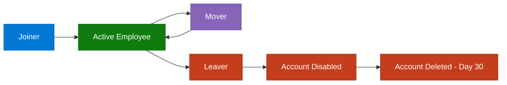

# Identity Lifecycle Management — Joiner, Mover, Leaver

*Author: Jonar | Repository: [jonarm](https://github.com/jonarm)*

---

## Purpose

This document describes the end-to-end identity lifecycle for 
Contoso Financial Services' Dynamics 365 ERP environment — covering 
how user access is created, modified, and removed across the 
employment lifecycle. It consolidates the workflows defined in 
[ADR-004](adr/ADR-004-scim-vs-manual-provisioning.md) into a single 
reference document.

The lifecycle is built on one core principle: **access should track 
employment status automatically**, not depend on a person remembering 
to action a request.

---

## Lifecycle Overview

---

## Source of Truth

The HR system is the **single authoritative source** for identity 
state. Entra ID and Dynamics 365 access are derived from HR system 
attributes via SCIM 2.0 — IT does not manually create, modify, or 
remove access outside of the documented exception process.

| HR Attribute | Drives |
|---|---|
| `employment_status` | Account enabled/disabled state |
| `job_title` | Access package assignment |
| `department` | Access package assignment |
| `manager_email` | Approval routing |
| `start_date` | Pre-provisioning timing |
| `termination_date` | Deprovisioning timing |

---

## Stage 1 — Joiner

**Trigger:** New employee record created in HR system

| Timing | Action |
|---|---|
| Day -5 | HR creates employee record; SCIM syncs to Entra ID; account created in disabled state |
| Day -1 | Account enabled; access package assigned based on job title; D365 roles provisioned; welcome email sent; manager notified |
| Day 1 | Employee starts with working access; manager completes verification checklist |

**Access granted is determined entirely by job title** — see the 
job title to access package mapping table in 
[ADR-004](adr/ADR-004-scim-vs-manual-provisioning.md#job-title-to-access-package-mapping). 
No manual role selection is required or permitted outside the 
documented exception process.

---

## Stage 2 — Mover

**Trigger:** Job title or department change in HR system

| Timing | Action |
|---|---|
| Within 4 hours | SCIM update event detected; Entra ID attributes updated |
| Immediately after | New access package evaluated against new job title |
| Before old access removed | New access package granted first |
| After new access confirmed | Old access package removed |
| Throughout | SoD check validates the new role combination is conflict-free |

**Critical design rule: grant before revoke.** Access is never removed 
before the replacement access is confirmed active — this prevents an 
operational gap where an employee changing roles temporarily has no 
ERP access at all.

**SoD enforcement at the mover stage:** if the new role combination 
would violate a segregation of duties rule (see 
[segregation-of-duties.md](segregation-of-duties.md)), the automated 
provisioning is blocked and the security team is alerted for manual 
resolution rather than allowing a conflicting assignment.

---

## Stage 3 — Leaver

**Trigger:** `employment_status` changed to `Terminated` in HR system

| Timing | Action |
|---|---|
| Within 1 hour | SCIM deprovision event fires; Entra ID account disabled |
| Immediately | All active sessions invalidated; all access packages removed; D365 roles deprovisioned; PIM eligible assignments removed |
| Immediately | Sentinel logs the deprovisioning event; manager notified |
| Day +30 | Account permanently deleted from Entra ID; audit logs retained per retention policy |

**MFA methods are retained for 30 days** post-disable for audit 
purposes even though the account itself cannot authenticate — this 
preserves evidence in case of a dispute or investigation.

---

## The Control Gap This Closes

Prior to SCIM automation, deprovisioning relied on HR manually 
notifying IT, which produced two documented failures:

- Two terminated employees retained active Dynamics 365 access for 
  more than 30 days post-termination
- One transferred employee retained Finance Manager access after 
  moving to Procurement — a live SoD violation

This is also the exact control gap modelled in 
[Attack Scenario 02 — Dormant Account Reactivation](../attack-simulation/scenario-02-dormant-account-reactivation/README.md), 
where a disabled account's app role assignment was never removed, 
allowing later reactivation via a misconfigured SSPR policy.

**Sentinel detection rule** `erp-dormant-account-activation.json` 
exists specifically to catch this failure mode if it recurs — an 
account inactive for 14+ days that suddenly authenticates triggers a 
High severity incident.

---

## Exception Process

For access that doesn't fit the standard job title mapping:

1. Request submitted via Entra ID MyAccess portal with justification
2. Line manager approval
3. Security team validates against the SoD matrix
4. CISO approval required for any access outside standard mapping
5. Time-limited grant — maximum 90 days, must be renewed
6. Quarterly review of all active exceptions by CISO
7. Exception register maintained by Risk & Compliance

---

## Monitoring

All lifecycle events are logged to Entra ID audit logs and ingested 
into Microsoft Sentinel:

| Event | Detection |
|---|---|
| Leaver account not disabled within SLA | Sentinel alert — High |
| Manual role assignment outside SCIM | Sentinel alert — High |
| SoD conflict detected during mover provisioning | Sentinel alert — Critical |
| Dormant account reactivation | `erp-dormant-account-activation.json` — High |
| Exception access approaching expiry | Automated email reminder |

---

## Related Documentation

- [ADR-004: SCIM vs Manual Provisioning](adr/ADR-004-scim-vs-manual-provisioning.md) — full technical design and rationale
- [Segregation of Duties](segregation-of-duties.md) — SoD matrix referenced at the mover stage
- [ERP Threat Model](erp-threat-model.md) — TS-03 dormant account scenario
- [Attack Scenario 02](../attack-simulation/scenario-02-dormant-account-reactivation/README.md) — live simulation of this control gap

---

*Last updated: June 2026 | Author: Jonar*